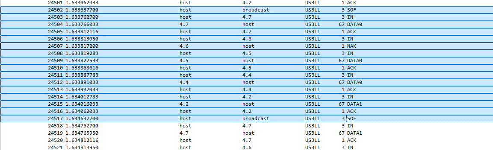

* USBFS MULTI EP PERFORMANCE

** INTERRUPT TRANSFER USE SINGLE EP

OPERATING SYSTEM RATE LIMIT : 64KiB/s:

#+BEGIN_SRC
1000 / 1ms(bInterval) = 1000Hz
64(BYTE) * 1000Hz = 64KiB/s
#+END_SRC

** INTERRUPT TRANSFER USE MULTI EP:

#+BEGIN_SRC
  USB IF0 HID EP IN 0X81
  USB IF1 HID EP IN 0X82
  USB IF2 HID EP IN 0X83
#+END_SRC

IF YOUR USB DEVICE(MCU/SOC) CAN PROC ALL EP IN REQEUST IN TIME:

MAX RATE IS :  64KiB/s * 3 = 192KiB/s

#+BEGIN_SRC
  USB HOST ------SOF-------> BORDCAST
  USB HOST ----EP 0x81 IN REQ---> USB DEVICE
  USB DEVICE ----ACK-------> USB HOST
  USB HOST ----EP 0x82 IN REQ---> USB DEVICE
  USB DEVICE ----ACK-------> USB HOST
  USB HOST ----EP 0x83 IN REQ---> USB DEVICE
  USB DEVICE ----ACK-------> USB HOST
  .............
  USB HOST ------SOF-------> BORDCAST
#+END_SRC

IF YOUR USB DEVICE(MCU/SOC) CAN'T SOME EP IN REQEUST IN TIME:

MAX RATE IS : 64KiB/s * 2 = 128KiB/s

#+BEGIN_SRC
  USB HOST ------SOF-------> BORDCAST
  USB HOST ----EP 0x81 IN REQ---> USB DEVICE
  USB DEVICE ----ACK-------> USB HOST
  USB HOST ----EP 0x82 IN REQ---> USB DEVICE
  USB DEVICE ----NAK-------> USB HOST
  USB HOST ----EP 0x83 IN REQ---> USB DEVICE
  USB DEVICE ----ACK-------> USB HOST
  .............
  USB HOST ------SOF-------> BORDCAST
#+END_SRC

WIRESHARK USBLL SNIFFER SAMPLE:

